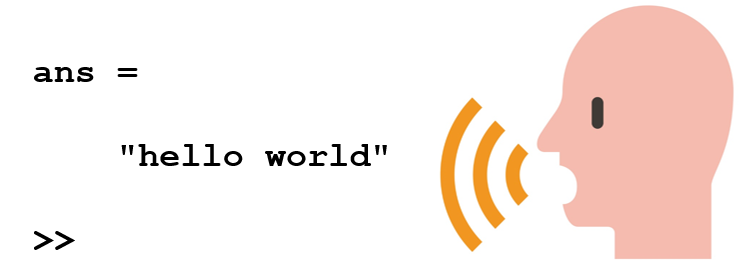
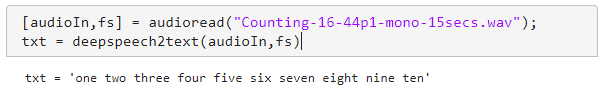
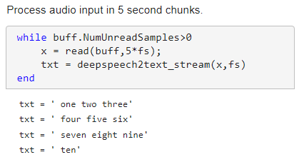
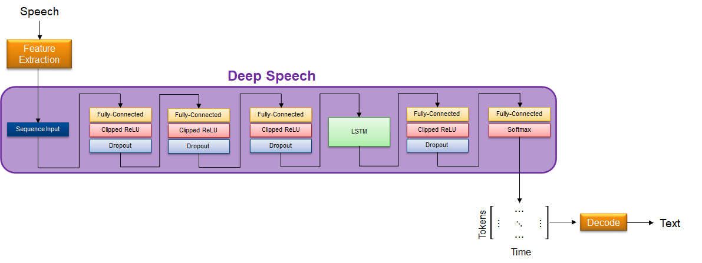

# deepspeech

# Speech-to-Text Transcription Using Deep Speech

This repo enables you to load a pretrained Deep Speech model into MATLAB&reg; and perform speech-to-text transcription [1].

**Creator**: MathWorks&reg; Development

## Requirements
- [MATLAB&reg;](http://www.mathworks.com) R2022a or later
- [Deep Learning Toolbox&trade;](https://www.mathworks.com/products/deep-learning.html)
- [Audio Toolbox&trade;](https://www.mathworks.com/products/audio.html)

To accelerate transcription, a GPU and the following toolbox is recommended:

- [Parallel Computing Toolbox&trade;](https://www.mathworks.com/products/parallel-computing.html)

To evaluate word error rate (WER), the following toolbox is recommended:
- [Text Analytics Toolbox&trade;](https://www.mathworks.com/products/text-analytics.html)

## Get Started
Download or clone this repositiory to your machine and open it in MATLAB&reg;.

Run ``deepspeech_inference.mlx`` to perform speech-to-text conversion on a specified audio file. The script plays the audio file to your default sound card and returns the text.

Run ``deepspeech_streaming.mlx`` to perform speech-to-text conversion on streaming audio input.

Run ``deepspeech_deployment.mlx`` to generate plain C code from the speech-to-text system. The script generates a MEX file which you can run from MATLAB to verify results.

Run ``deepspeech_transferlearning.mlx`` to learn how to retrain weights on the network so that speech-to-text performance is optimized for your needs.

The following files are included in the repo:

**Building blocks:**
- ``deepspeechFeatures.m`` - Extract features for DeepSpeech network
- ``deepspeechBuffer.m`` - Buffer features for DeepSpeech network
- ``deepspeech.m`` - Load DeepSpeech speech-to-text network
- ``deepspeechPostprocess.m`` - Decode output from DeepSpeech network

**All-in-one:**
- ``deepspeech2text.m`` - Transcribe speech to text using DeepSpeech

- ``deepspeech2text_stream.m`` - Transcribe streaming speech to text using DeepSpeech

## Network Details
The model provided in this example corresponds to the pretrained Deep Speech model provided by [2]. The model was trained using the Fisher, LibriSpeech, Switchboard, and Common Voice English datasets, and approximately 1700 hours of transcribed WAMU (NPR) radio shows explicitly licensed to use as training corpora.

## Metrics and Evaluation
### Accuracy Metrics
[2] reports a 5.97% word error rate (WER) on the LibriSpeech clean test set. The WER corresponds to the acoustic model (included in this repo) **and** a language model, which is not included in this repo.

### Size
The total size of the model is 167 MB.

## License
The license is available in the [License.txt](License.txt) file in this repository.

## References
[1] Hannun, A. "DeepSpeech: Scaling up end-to-end speech recognition", 2014.

[2] https://github.com/mozilla/DeepSpeech/releases/tag/v0.7.1

Copyright 2022 The MathWorks, Inc.
